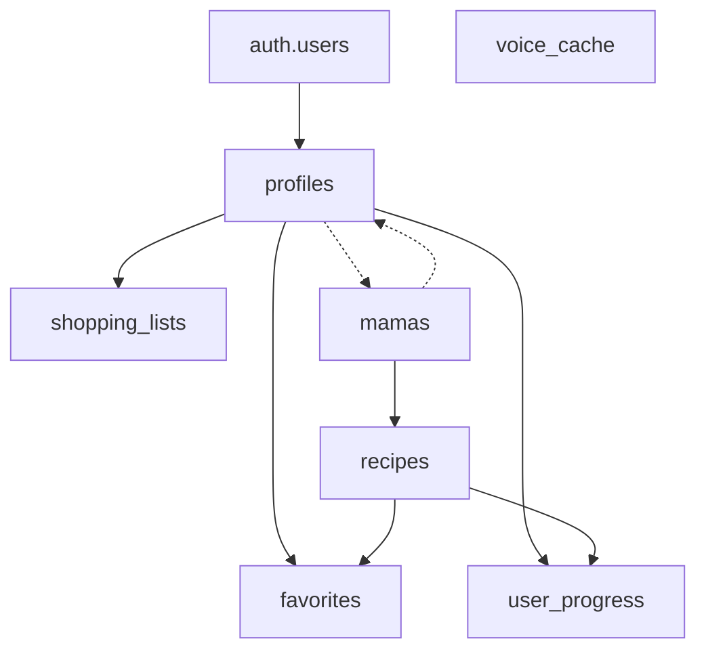

# MAMIA Database Setup

This directory contains the complete database schema, migrations, and seed data for the MAMIA cooking app.

## 🗄️ Database Schema

### Tables Overview

| Table | Purpose | Access Control |
|-------|---------|----------------|
| `profiles` | User profiles extending auth.users | User-owned |
| `mamas` | Cooking mentors/characters | Public read, Admin write |
| `recipes` | Recipe content | Public read, Admin write |
| `user_progress` | User cooking progress | User-owned |
| `favorites` | User favorite recipes | User-owned |
| `shopping_lists` | User shopping lists | User-owned |
| `voice_cache` | Cached voice audio | Service role managed |

### Key Features

- **Row Level Security (RLS)** enabled on all tables
- **Automatic profile creation** on user signup
- **Voice caching system** for performance
- **Comprehensive indexing** for optimal queries
- **JSONB fields** for flexible recipe data
- **Custom enum types** for consistent data

## 🚀 Quick Start

### 1. Environment Setup

Ensure your `.env.local` file contains:

```bash
NEXT_PUBLIC_SUPABASE_URL=your_supabase_url
SUPABASE_SERVICE_KEY=your_service_key
```

### 2. Run Migrations

```bash
# Install dependencies
npm install

# Deploy all migrations
npm run db:migrate

# Or run dry-run first to see what will be executed
npm run db:migrate:dry
```

### 3. Verify Setup

After running migrations, your database will have:
- ✅ 7 tables with proper RLS policies
- ✅ 3 Mamas with 5 recipes each (15 total recipes)
- ✅ Automatic profile creation trigger
- ✅ Voice caching system
- ✅ Comprehensive indexes

## 📁 Migration Files

### `20250107_001_initial_schema.sql`
- Creates all 7 tables with proper structure
- Defines custom enum types
- Sets up foreign key relationships
- Creates performance indexes
- Adds updated_at triggers

### `20250107_002_rls_policies.sql`
- Enables RLS on all tables
- Creates admin role check functions
- Implements user-specific access controls
- Sets up automatic profile creation
- Configures voice cache permissions

### `20250107_003_seed_data.sql`
- Inserts 3 diverse Mamas:
  - **Nonna Isabella** (Italian cuisine)
  - **Mama Rosa** (Mexican cuisine)
  - **Chef Kenji** (Japanese cuisine)
- Adds 5 authentic recipes per Mama
- Includes detailed ingredients and steps
- Provides cultural context for each dish

## 🔐 Security Model

### Public Access
- ✅ Read access to `mamas` and `recipes`
- ✅ Voice cache read for authenticated users

### User Access
- ✅ Full CRUD on own profile
- ✅ Full CRUD on own progress, favorites, shopping lists
- ❌ No access to other users' private data

### Admin Access
- ✅ Full control over mamas and recipes
- ✅ Read access to all user data
- ✅ Voice cache management

### Service Role
- ✅ Voice cache management
- ✅ Automatic profile creation
- ✅ Background maintenance tasks

## 🍳 Sample Data

### Mamas Included

1. **Nonna Isabella** (Italian)
   - Signature: Homemade Ragu Bolognese
   - Personality: Warm, patient, storytelling
   - Recipes: Carbonara, Osso Buco, Risotto, Tiramisu, Margherita Pizza

2. **Mama Rosa** (Mexican)
   - Signature: Mole Negro Oaxaqueño
   - Personality: Energetic, passionate, cultural
   - Recipes: Chicken Mole, Tacos al Pastor, Chiles Rellenos, Pozole, Guacamole

3. **Chef Kenji** (Japanese)
   - Signature: Seasonal Kaiseki Menu
   - Personality: Precise, mindful, seasonal
   - Recipes: Sushi Rice, Teriyaki Chicken, Miso Soup, Beef Ramen, Tempura

### Recipe Features

- **Detailed ingredients** with amounts and notes
- **Step-by-step instructions** with durations
- **Cultural context** and cooking tips
- **Difficulty levels** (easy, medium, hard)
- **Offline availability** flags
- **Prep and cook times**

## 🛠️ Maintenance

### Cleanup Functions

```sql
-- Clean expired voice cache
SELECT cleanup_expired_voice_cache();
```

### Common Queries

```sql
-- Get all recipes for a mama
SELECT * FROM recipes WHERE mama_id = 'mama_uuid';

-- Get user's favorite recipes with mama info
SELECT r.*, m.name as mama_name 
FROM recipes r
JOIN mamas m ON r.mama_id = m.id
JOIN favorites f ON r.id = f.recipe_id
WHERE f.user_id = 'user_uuid';

-- Get user's cooking progress
SELECT r.title, up.current_step, up.completed, up.started_at
FROM user_progress up
JOIN recipes r ON up.recipe_id = r.id
WHERE up.user_id = 'user_uuid';
```

## 🔧 Troubleshooting

### Migration Fails

1. **Check environment variables** are set correctly
2. **Verify Supabase service key** has proper permissions
3. **Check database connection** to your Supabase project
4. **Review error logs** for specific SQL issues

### Permission Errors

1. **Ensure RLS policies** are properly applied
2. **Check user authentication** status
3. **Verify admin role** is set in user metadata
4. **Test with service role** for admin operations

### Performance Issues

1. **Check indexes** are created properly
2. **Monitor query performance** in Supabase dashboard
3. **Use voice caching** for repeated audio requests
4. **Optimize JSONB queries** with proper indexing

## 📊 Database Diagram



## 🎯 Next Steps

After successful migration:

1. **Test authentication** flow in your app
2. **Verify RLS policies** with different user roles
3. **Test recipe queries** and filtering
4. **Implement voice caching** in your API routes
5. **Add custom validation** as needed
6. **Set up monitoring** for performance

## 📝 Schema Details

### Custom Types

```sql
-- Cooking skill levels
CREATE TYPE cooking_level AS ENUM ('beginner', 'intermediate', 'advanced', 'expert');

-- Recipe difficulty
CREATE TYPE difficulty_level AS ENUM ('easy', 'medium', 'hard');

-- Subscription tiers
CREATE TYPE subscription_tier AS ENUM ('free', 'premium', 'family');

-- Cuisine categories
CREATE TYPE cuisine_type AS ENUM (
  'italian', 'mexican', 'chinese', 'indian', 'japanese', 'french', 
  'thai', 'mediterranean', 'american', 'korean', 'vietnamese', 'greek'
);
```

### JSONB Schema Examples

#### Recipe Ingredients
```json
[
  {
    "name": "Spaghetti",
    "amount": 400,
    "unit": "g",
    "notes": "Use good quality pasta"
  }
]
```

#### Recipe Steps
```json
[
  {
    "step": 1,
    "description": "Bring a large pot of salted water to boil",
    "duration": 5
  }
]
```

#### Shopping List Items
```json
[
  {
    "name": "Tomatoes",
    "amount": 4,
    "unit": "pieces",
    "checked": false,
    "category": "produce"
  }
]
```

---

**Need help?** Check the [Supabase documentation](https://supabase.com/docs) or open an issue in the project repository. 